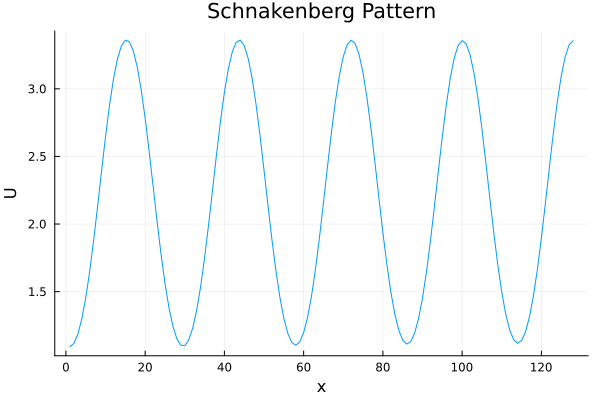

# PseudoSpectral.jl


[](https://github.com/twhiscock/ReactionDiffusion.jl/actions/workflows/CI.yml?query=branch%3Amaster)


This package provides a DCT based discretisation for 1D reaction-diffusion PDEs, designed to be used with the exponential time-differencing solvers provided by [OrdinaryDiffEqExponentialRK](https://docs.sciml.ai/DiffEqDocs/stable/api/ordinarydiffeq/semilinear/ExponentialRK/). It supports PDE systems of the form:


$` \begin{align*} \mathbf{u}_{t}(x,t) &= \mathbf{D} \mathbf{u}_{xx}(x,t) + \mathbf{f}(\mathbf{u}(x,t)) \\
  \mathbf{u}(x,0) &= \mathbf{g}(x) \\
  \mathbf{u}_x(0,t) &= a \\
  \mathbf{u}_x(1,t) &= b \\
\end{align*} `$


For an interactive front-end which integrates with the Catalyst chemical modelling DSL, see [ReactionDiffusion.jl](https://github.com/hiscocklab/ReactionDiffusion.jl).


<a id='Example-Heat-Equation'></a>

<a id='Example-Heat-Equation-1'></a>

## Example - Heat Equation


PseudoSpectral.jl follows the interface of SciML:


```julia
using PseudoSpectralReactionDiffusion
using Symbolics: @variables
using Plots

@variables U,V, Dᵤ, Dᵥ, a, b,L
R = [a-U+U^2*V, b-U^2*V]
D = [Dᵤ/L^2, Dᵥ/L^2]
B = [0 0; 0 0]
IC = [0,0]
n=128
dt=0.001

prob = PseudoSpectralProblem([U,V], R, D, B, IC, n; p = Dict(Dᵤ=>1.0, Dᵥ=>50.0, a=>0.2, b=>2.0, L=>50.0))
sol = solve(prob; tspan=(0.0,200.0), dt=dt)
plot(sol[U][end]; xlabel="x", ylabel="U", legend=false, title="Schnakenberg Pattern")
```



## API

```julia
PseudoSpectralProblem(species, reaction_rates, diffusion_rates, boundary_conditions, initial_conditions, num_verts; p=nothing, noise=1e-4, rng=default_rng(), kwargs...)
```

Construct a PsuedoSpectralProblem object representing a reaction diffusion system of the form uₓₓ(x,t) = Duₜ(x,t) + f(u(x,t)).

**Arguments**

PseudoSpectral expects Symbolics.jl expressions as inputs. The special variable 'x' ∈ [0,1] represents the spatial coordinate. Any variables other than 'x' and those supplied in `species` will be interpreted as parameters.

  * `species`: Vector of variables corresponding to the components of u.
  * `reaction_rates`: Vector of expressions representing f(u).
  * `diffusion_rates`: Vector of Expressions representing diag(D).
  * `boundary_conditions`: 2xn matrix of expressions representing Neumann boundary conditions. The two rows correspond to uₓ at the left and right boundaries.
  * `initial_conditions`: Vector of expressions representing u(x,0).
  * `num_verts`: Number of points in spatial discretisation.
  * `p=nothing`: Dictionary associating parameters with numerical values.
  * `noise=1e-4`: Guassian noise with σ²=`noise` is added to the initial conditions.
  * `rng=default_rng()`: Random number generator for noise.
  * `kwargs...`: Keyword arguments passed on to SciML's `solve`. For details see https://docs.sciml.ai/DiffEqDocs/stable/basics/common*solver*opts/.


```julia
PseudoSpectralSolution
```

Solution object for PsuedoSpectralProblem.

**Indexing**

  * By time-step `sol[3]`.
  * By species `sol[U]`.

```julia
solve(prob::PseudoSpectralProblem, alg=ETDRK4(); kwargs...)
```

See https://docs.sciml.ai/DiffEqDocs/stable/basics/common*solver*opts/. Algorithm defaults to [ETDRK4](https://docs.sciml.ai/DiffEqDocs/stable/api/ordinarydiffeq/semilinear/ExponentialRK/#OrdinaryDiffEqExponentialRK.ETDRK4).

```julia
init(prob::PseudoSpectralProblem; alg=ETDRK4(), dt=0.1, kwargs...)
```

Initialize an integrator for the problem. See https://docs.sciml.ai/DiffEqDocs/stable/basics/integrator/. Algorithm defaults to [ETDRK4](https://docs.sciml.ai/DiffEqDocs/stable/api/ordinarydiffeq/semilinear/ExponentialRK/#OrdinaryDiffEqExponentialRK.ETDRK4).

```julia
get_u(integrator::PseudoSpectralIntegrator)
```

Return solution values at time `t`, stepping the integrator as necessary.

```julia
get_sol(integrator::PseudoSpectralIntegrator)
```

Return a solution object for the current integrator state.

```julia
step!(integrator::PseudoSpectralIntegrator, dt=nothing, stop_at_tdt=false)
```

Advance the iterator by `dt`.

```julia
step_to!(integrator::PseudoSpectralIntegrator, t, stop_at_tdt=false)
```

Advance the iterator to time `t`.

## Support, citation and future developments


If you find ReactionDiffusion.jl helpful in your research, teaching, or other activities, please star the repository and consider citing [this paper](https://www.biorxiv.org/content/10.1101/2025.05.27.656324v1).


We are a small team of academic researchers from the [Hiscock Lab](https://twhiscock.github.io/), who build mathematical models of developing embryos and tissues. We have found these tools helpful in our own research, and make them available in case you find them helpful in your research too. We hope to extend the functionality of ReactionDiffusion.jl as our future projects, funding and time allows.


This work is supported by ERC grant SELFORG-101161207, and UK Research and Innovation (Biotechnology and Biological Sciences Research Council, grant number BB/W003619/1) 


*Funded by the European Union. Views and opinions expressed are however those of the author(s) only and do not necessarily reflect those of the European Union or the European Research Council Executive Agency. Neither the European Union nor the granting authority can be held responsible for them*


